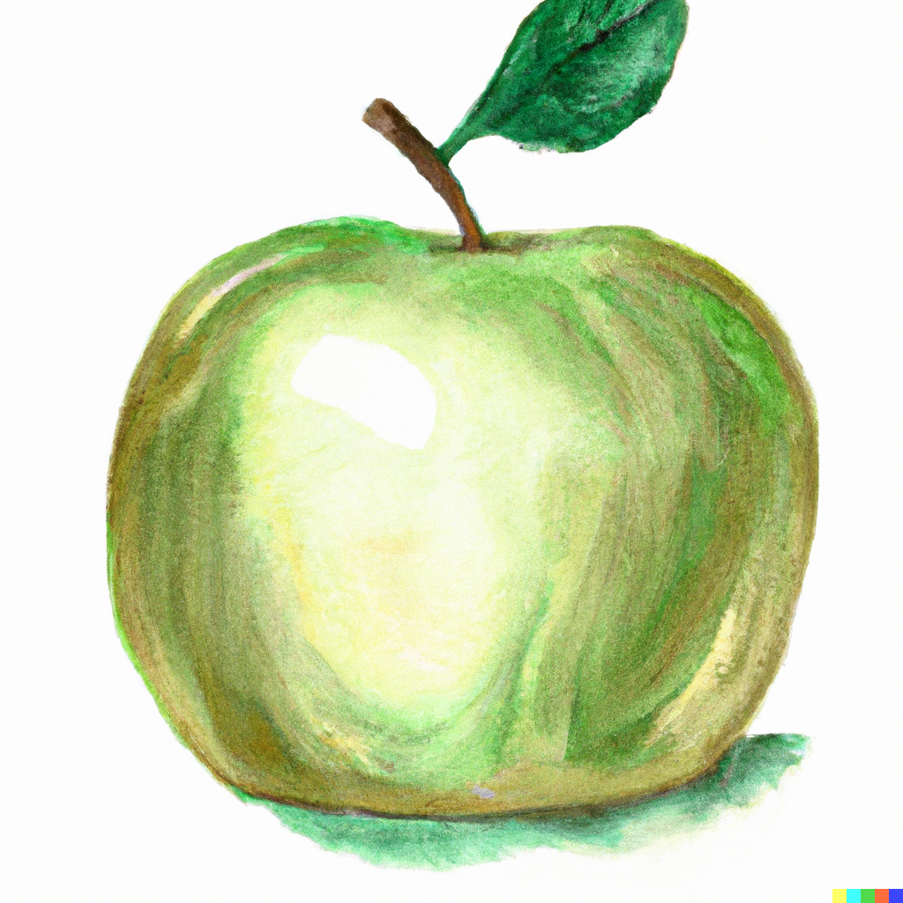

# Ябълка

## Какво са ябълките

Ябълката е плод, който расте на ябълковите дървета. Тя е едно от най-широко използваните и консумирани плодове по света и се използва за храна, напитки, домашно приготвяне на оцет и много други цели.

Ябълките са кръгли или овални, обикновено с диаметър между 5 и 10 сантиметра, и могат да бъдат различни цветове, като червено, жълто, зелено или комбинация от тези. Те са богати на фибри, витамини и минерали, като витамин С, калий, фолиева киселина и др.

Ябълките могат да се ядат свежи, сурови или приготвени в различни ястия, напитки или сладкиши. Те се считат за един от най-здравословните плодове, тъй като имат малко калории, но много полезни хранителни вещества, които помагат да се подобри здравето и доброто самочувствие.

## Хранителен Състав на ябълките

Ябълките имат и други ползи за здравето, освен тези, които споменах по-рано. Например, те са източник на антиоксиданти, като кверцетин, който може да подобри функцията на сърцето, като намалява риска от развитие на сърдечносъдови заболявания.

Ябълките също така могат да бъдат полезни за контролиране на кръвната захар и управление на диабета, благодарение на високото съдържание на фибри и ниската гликемична карта на ябълките. Това означава, че те могат да бъдат консумирани без да повлияят значително на нивата на кръвната захар.

Когато ябълките се ядат с кожата, те могат да бъдат полезни за здравето на устната кухина, като премахват бактерии и помагат за предотвратяване на зъбен кариес.

И накрая, ябълките могат да бъдат полезни за намаляване на риска от развитие на различни видове рак, включително рак на дебелото черво, бели дробове и мастноклетъчни тумори.

Общо взето, ябълките са вкусен и полезен плод, който може да бъде включен във всяка хранителна програма. Важно е обаче да се има предвид, че те могат да бъдат високи на пестициди, затова е важно да се избират био или органични ябълки, ако е възможно.

## Ябълките в медицината

## Полезни свойства на Ябълките

## Типове Ябълки

## Състав на Ябълките
